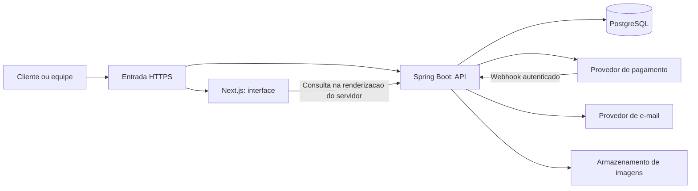
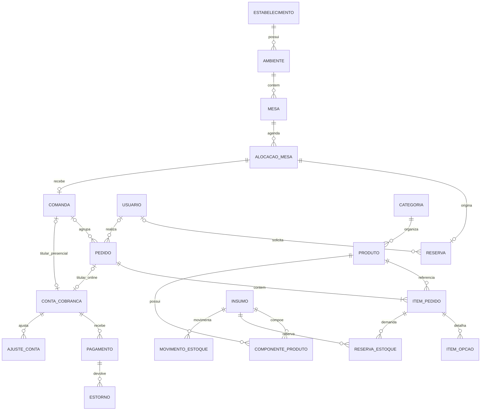

# Puzzle Bar — planejamento e arquitetura

**Versão:** 0.1 — proposta para revisão.  
**Data:** 25/09/2026.  
**Entrega atual:** somente documentação; nenhuma aplicação foi implementada.
**Estado:** planejamento pausado pelo autor; arquivo salvo e pronto para retomada.

## 1. Visão do produto

O Puzzle Bar será um pub com características marcantes de Londres e da Alemanha. A aplicação reúne apresentação do estabelecimento, cardápio, reservas, atendimento presencial, pedidos online e pagamentos.

O objetivo educacional é aprender uma aplicação web de ponta a ponta, aprofundando banco de dados, APIs, segurança, transações e operação. A qualidade profissional deve aparecer na consistência dos dados, experiência dos usuários, testes, documentação e recuperação de falhas.

### 1.1 Confirmado pelo autor

- Front-end em Next.js e back-end em Spring Boot.
- Banco em escolha entre PostgreSQL e MySQL.
- Reservas, pedidos online e pagamentos fazem parte do produto.
- Identidade londrina e alemã; possibilidade de comercialização futura.
- Planejar antes de programar; neste momento, criar apenas um documento.

### 1.2 Propostas adotadas

Estas escolhas tornam o plano concreto, mas ainda podem ser revistas pelo autor.

| Tema | Proposta inicial | Consequência |
| --- | --- | --- |
| Operação | Um pub | Sem estrutura de SaaS inicialmente |
| Banco | PostgreSQL | Estudo de SQL, integridade e concorrência |
| Pedido online | Retirada no pub | Delivery fica para evolução |
| Pedido presencial | Equipe registra em comanda de mesa | Autopedido por QR Code posterior |
| Cliente no site | Conta necessária para reservar/comprar | Histórico e autorização por proprietário |
| Cliente presencial | Conta não obrigatória | Equipe registra contato avulso quando necessário |
| Reserva | Uma mesa por reserva, com duração definida | Junção de mesas atendida manualmente |
| Pagamento online | Antecipado em checkout de provedor | Preparação após confirmação válida |
| Pagamento presencial | Equipe registra dinheiro/cartão/Pix, conforme métodos adotados | Sem presumir integração com maquininha |
| Sinal de reserva | Não cobrar no início | Depósito exige fluxo financeiro próprio |
| Localização | Uma moeda e um fuso configurados | Confirmar país e regras aplicáveis |

A temática europeia não determina país de operação, moeda ou legislação. Eventos temáticos e conteúdo institucional podem começar como conteúdo versionado, sem CMS.

## 2. Escopo e entregas

| Entrega | Funcionalidades | Resultado verificável |
| --- | --- | --- |
| E1 — Site e reservas | Site, cardápio, acesso, equipe, mesas, horários e reservas | Cliente reserva; equipe acompanha e registra chegada |
| E2 — Operação presencial | Comandas, pedidos, preparação e recebimentos manuais | Uma visita completa é atendida |
| E3 — Compra online | Carrinho, checkout, retirada, pagamento integrado e estorno | Cliente paga e acompanha; equipe prepara e entrega |
| E4 — Gestão | Estoque, fichas técnicas, compras, caixa e relatórios ampliados | Consumo, perdas e fechamento são rastreáveis |
| E5 — Evolução comercial | Adaptações orientadas por clientes reais | Produto validado antes de construir SaaS |

**Primeiro MVP publicável: E1. Primeira versão que contempla todos os fluxos comerciais solicitados: E1 + E2 + E3.** Estoque completo não deve bloquear a primeira jornada.

Fora do início: delivery, marketplace, fidelidade, cupons, divisão de itens por pessoa, junção automática de mesas, emissão fiscal integrada, folha de pagamento, aplicativo nativo, operação offline completa e SaaS por assinatura.

## 3. Usuários e permissões

Um usuário pode acumular papéis. Papéis iniciais são fixos; não é necessário construir um editor genérico de permissões.

| Papel | Ações | Limites principais |
| --- | --- | --- |
| Visitante | Site, cardápio e disponibilidade geral | Sem dados pessoais de clientes |
| Cliente | Perfil, próprias reservas e próprios pedidos | Sem acesso a recursos alheios |
| Atendimento | Reservas, chegada, mesas, comandas e pedidos | Sem alterar preços ou conceder privilégios |
| Preparação | Itens de cozinha/bar e atualização de preparo | Sem dados financeiros/pessoais desnecessários |
| Caixa | Conta, recebimentos e fechamento | Estorno e desconto excepcional exigem gerência |
| Gerente | Cardápio, equipe operacional, descontos, cancelamentos, estornos e relatórios | Não atribui papel de proprietário |
| Proprietário | Configuração sensível e acesso integral ao pub | Ações sensíveis continuam auditadas |

Autorizar ação e recurso no Spring. Ocultar botão não protege API. Impedir autoelevação e remoção do último proprietário ativo. Referência: [autorização no OWASP](https://cheatsheetseries.owasp.org/cheatsheets/Authorization_Cheat_Sheet.html).

## 4. Jornadas e regras de negócio

### 4.1 Reserva

1. Cliente informa data, horário e pessoas.
2. API verifica funcionamento, capacidade, duração e bloqueios.
3. Cliente autentica, informa contato e confirma a política apresentada.
4. API escolhe mesa compatível e grava reserva/alocação em uma transação.
5. Se outro cliente tomou o horário, retornar conflito e alternativas.
6. Confirmação aparece na aplicação; e-mail é enviado separadamente com retentativas.
7. Equipe registra check-in e, em E2, abre comanda na mesma alocação.
8. Cancelamento/ausência libera o intervalo conforme a política.

Consultar horário não bloqueia mesa. Proposta de protótipo: duração de 2 horas e tolerância de 15 minutos, configuráveis e ainda a validar. Ausência é registrada pela equipe inicialmente, sem cancelamento automático apenas pelo relógio.

Horários podem atravessar meia-noite; exceções de calendário prevalecem sobre semana. Inativar mesa impede novas reservas, mas exige resolver as futuras existentes.

### 4.2 Atendimento presencial

1. Equipe abre comanda em mesa livre, com ou sem reserva.
2. Seleciona produtos/adicionais e envia uma rodada de pedido.
3. API calcula valores e encaminha itens para cozinha/bar.
4. Preparação marca itens em preparo e prontos.
5. Atendimento entrega e pode lançar novas rodadas.
6. Caixa solicita fechamento, bloqueando novos lançamentos.
7. Registra um ou mais pagamentos até quitar o saldo.
8. Fecha comanda e encerra ocupação real da mesa.

**Comanda** representa a visita e consumo acumulado. **Pedido** representa uma rodada de itens. **Pagamento** representa uma tentativa ou recebimento. São entidades distintas.

Reserva planeja ocupação; comanda aberta representa ocupação real. Fim previsto não libera automaticamente mesa com clientes. Prolongamento deve detectar conflito com a próxima reserva e exigir intervenção da equipe.

### 4.3 Compra online para retirada

1. Cliente monta carrinho; valores no navegador são estimativas.
2. API revalida preços, opções, disponibilidade e horário de retirada.
3. Cliente confirma orçamento e contato.
4. API cria pedido, conta e tentativa de pagamento de forma idempotente.
5. Provedor disponibiliza checkout seguro.
6. Back-end confirma pagamento por comunicação autenticada com o provedor.
7. Pedido confirmado entra em preparação e acompanhamento.
8. Equipe verifica código de retirada e registra entrega.

Preço alterado exige nova confirmação antes de cobrar. Retorno do navegador não comprova pagamento. Pagamento pendente permanece visível e retoma a mesma tentativa quando permitido. Retirada imediata dentro do horário habilitado é a proposta inicial; agendamento é posterior.

### 4.4 Cancelamento e devolução

Cancelar pedido e devolver pagamento são ações diferentes. Pedido cancelado pode ter estorno em processamento. Preservar motivo, autor, itens, recebimento original e resultado financeiro.

Proposta: cliente cancela sozinho antes de confirmação do pagamento; depois solicita à equipe. Gerência avalia preparação e política comercial, que precisa ser definida antes da operação real.

Descontos e taxa de serviço são ajustes rastreáveis. Não presumir percentual obrigatório. Item preparado não sofre edição destrutiva: correção por cancelamento justificado e novo lançamento, com tratamento financeiro e de estoque.

## 5. Arquitetura técnica

### 5.1 Visão geral

Entrada pública encaminha páginas para Next.js e `/api/*` para Spring, na mesma origem. Em desenvolvimento, reproduzir encaminhamento ou liberar somente a origem local necessária no CORS.

Next.js apresenta e interage. Spring concentra autenticação, autorização, regras, valores, transações e persistência. Next.js não acessa diretamente o banco. Renderização privada no servidor encaminha sessão de forma controlada e não usa cache compartilhado entre usuários. Next.js permite uma camada BFF, mas duplicar regras nela não é necessário aqui. [Documentação Next.js](https://nextjs.org/docs/app/guides/backend-for-frontend).

### 5.2 Monólito modular

Uma aplicação Spring implantável, organizada por negócio, e um PostgreSQL. Proposta adequada ao desenvolvimento individual, ao estudo de transações e a uma implantação com poucas peças.

| Módulo | Responsabilidade |
| --- | --- |
| identity | Usuários, credenciais, sessões e papéis |
| establishment | Pub, horários, ambientes e mesas |
| catalog | Produtos, categorias, imagens, opções e disponibilidade |
| reservations | Disponibilidade, alocação, reserva e chegada |
| service | Comandas e salão |
| orders | Pedidos, itens, histórico e preparo |
| billing | Contas, ajustes, pagamentos, estornos e conciliação |
| inventory | Insumos, receitas, reservas e movimentos |
| reporting | Consultas e indicadores |
| notifications | Solicitações e tentativas de envio |
| audit | Ações relevantes |

Módulos expõem casos de uso e evitam acesso aos repositories de outros módulos. Transações locais podem coordenar serviços públicos de vários módulos. Relatórios podem usar consultas próprias de leitura.

Dentro de cada módulo: controllers para HTTP, DTOs para contratos, serviços de aplicação para coordenar operações, regras de domínio e repositories. Adicionar interfaces/camadas quando tiverem função concreta. Spring Modulith pode verificar fronteiras e testar módulos futuramente. [Referência oficial](https://spring.io/projects/spring-modulith/).

### 5.3 Ferramentas propostas

| Área | Escolha | Propósito |
| --- | --- | --- |
| Interface | Next.js + TypeScript | Navegação, renderização e tipagem |
| API | Spring Boot + Java | Stack escolhida e estudo do ecossistema |
| Segurança | Spring Security | Sessões e autorização |
| Persistência | Spring Data JPA e SQL explícito quando necessário | Produtividade com entendimento do SQL |
| Banco/migrations | PostgreSQL + Flyway | Integridade e evolução reproduzível |
| Contratos | OpenAPI | Documentação verificável |
| Ambiente local | Docker Compose | Dependências reproduzíveis |
| Testes | JUnit, Spring Boot Test, Testcontainers e Playwright | Regras, integração e jornadas |
| Entrega | CI no repositório e imagens de aplicação | Verificação e implantação repetíveis |

Fixar versões estáveis e compatíveis ao iniciar código. Esta tabela não é uma matriz de versões já validada. Estrutura futura: `frontend/`, `backend/`, `infra/` e `docs/`.

Redis, Kafka, Kubernetes, Elasticsearch e microsserviços dependem de necessidade medida. Tarefas agendadas e tabelas duráveis podem atender ao início.

## 6. Banco de dados

### 6.1 Recomendação e convenções

**Recomendo PostgreSQL.** MySQL com InnoDB também atende ao projeto. Um diferencial útil neste domínio é explorar intervalos e constraints de exclusão para impedir reservas sobrepostas. A documentação demonstra esse padrão para recursos reserváveis. [PostgreSQL: intervalos](https://www.postgresql.org/docs/current/rangetypes.html), [MySQL: InnoDB](https://dev.mysql.com/doc/refman/8.4/en/innodb-storage-engine.html).

- UUID como proposta de ID; identificadores não substituem autorização.
- PK identifica linha; FK referencia tabela; UNIQUE impede repetição; CHECK restringe valores.
- Instantes com semântica de fuso; apresentação no fuso do pub. Definir data comercial para turnos após meia-noite.
- Dinheiro decimal exato/BigDecimal, moeda e arredondamento explícitos. `numeric(12,2)` é proposta para moeda de duas casas; confirmar moeda/limites antes do DDL. Insumos podem exigir mais precisão.
- Quantidade vendida em unidades inteiras no MVP; volumes distintos são produtos/variantes com receitas próprias.
- Cadastros mutáveis recebem criação/atualização e versão quando necessário à concorrência.
- Preservar nome, preço e adicionais históricos de vendas.
- Preservar transações e devoluções; inativar produtos referenciados. Dados pessoais têm retenção própria.
- Flyway altera esquema; Hibernate valida nos ambientes implantados, sem alteração automática.
- Estudar SQL, índices e planos de execução mesmo com JPA.

Referências: [constraints](https://www.postgresql.org/docs/current/ddl-constraints.html) e [tipos numéricos](https://www.postgresql.org/docs/current/datatype-numeric.html).

O inventário abaixo é um modelo lógico. Tamanhos, nulabilidade completa e DDL serão refinados antes de cada implementação. E1–E4 identificam a entrega que exige a entidade.

### 6.2 Identidade e estabelecimento

| Entidade | Campos principais | Regra/finalidade | Entrega |
| --- | --- | --- | --- |
| usuario | id, nome, email_normalizado, telefone, senha_hash, status, email_verificado_em | E-mail único; hash de senha | E1 |
| usuario_papel | usuario_id FK, papel | Par único; papéis fixos | E1 |
| token_acesso | id, usuario_id FK, finalidade, token_hash, expira_em, consumido_em | Recuperação/verificação; uso único | E1 |
| estabelecimento | id, nome, slug, contatos, endereço público, fuso, moeda, parâmetros | Um registro inicial; slug único | E1 |
| horario_funcionamento | id, estabelecimento_id FK, dia_semana, inicio, fim, termina_dia_seguinte, canal | Salão/retirada; várias faixas por dia | E1 |
| excecao_funcionamento | id, estabelecimento_id FK, data, fechado, intervalos_substitutos, motivo | Substitui semana; intervalos estruturados e validados | E1 |
| ambiente | id, estabelecimento_id FK, nome, ativo | Salão, área externa etc. | E1 |
| mesa | id, ambiente_id FK, codigo, capacidade, ativa | Código único no pub; capacidade positiva | E1 |

Sessões são infraestrutura do framework. JDBC é proposta de armazenamento para sobreviver a reinícios; tabelas de Spring Session serão tratadas segundo a configuração escolhida.

### 6.3 Cardápio

| Entidade | Campos principais | Regra/finalidade | Entrega |
| --- | --- | --- | --- |
| categoria | id, estabelecimento_id FK, nome, slug, ordem, ativa | Slug único no pub | E1 |
| produto | id, categoria_id FK, nome, slug, descricao, preco_atual, setor_preparo, ativo, disponivel, alcoolico | Preço não negativo; BAR/COZINHA/SEM_PREPARO | E1 |
| imagem_produto | id, produto_id FK, chave_arquivo, texto_alternativo, ordem | Arquivo fora do banco; guardar referência | E1 |
| grupo_opcao | id, produto_id FK, nome, minimo, maximo | Limites válidos de seleção | E2 |
| opcao_produto | id, grupo_opcao_id FK, nome, acrescimo_preco, ativa | Escolhas/adicionais validados no servidor | E2 |
| alergeno | id, nome | Vocabulário informado pelo pub | E1 |
| produto_alergeno | produto_id FK, alergeno_id FK, tipo_aviso | Contém/pode conter conforme informação validada | E1 |

Origem de pratos/bebidas pode começar como texto editorial. Não inferir alergênicos pelo nome do prato. Entidade de origem só se justifica por filtros/regras reais.

### 6.4 Reservas e salão

| Entidade | Campos principais | Regra/finalidade | Entrega |
| --- | --- | --- | --- |
| alocacao_mesa | id, mesa_id FK, inicio, fim, tipo, ativa, motivo | Agenda de reserva, entrada sem reserva e bloqueio manual | E1 |
| reserva | id, alocacao_mesa_id FK único, cliente_id FK opcional, nome_contato, telefone_contato, pessoas, status, codigo, observacao, politica_versao | Site exige cliente; equipe aceita avulso; código único | E1 |
| comanda | id, alocacao_mesa_id FK único, cliente_id FK opcional, aberta_por FK, status, aberta_em, fechada_em, versao | Uma visita por alocação; uma comanda ativa por mesa | E2 |

Mesma alocação pode se ligar à reserva e à comanda no check-in, evitando dois bloqueios para uma visita. Mesa/horário vêm da alocação. Bloqueios manuais participam da mesma agenda e regra de não sobreposição.

### 6.5 Pedidos e preparação

| Entidade | Campos principais | Regra/finalidade | Entrega |
| --- | --- | --- | --- |
| pedido | id, estabelecimento_id FK, cliente_id FK opcional, comanda_id FK opcional, canal, status, subtotal, total, moeda, criado_por FK, codigo_retirada, versao | SALAO exige comanda; RETIRADA exige cliente na proposta | E2/E3 |
| item_pedido | id, pedido_id FK, produto_id FK, nome_snapshot, quantidade, preco_base_snapshot, total_item, observacao, setor_snapshot, status_preparo | Quantidade positiva e histórico da venda | E2 |
| item_opcao | id, item_pedido_id FK, opcao_produto_id FK, nome_snapshot, acrescimo_snapshot, quantidade | Opções escolhidas e cobradas | E2 |
| historico_pedido | id, pedido_id FK, estado_anterior, estado_novo, autor_id FK opcional, motivo, ocorrido_em | Transições operacionais | E2 |
| historico_item | id, item_pedido_id FK, estado_anterior, estado_novo, autor_id FK, motivo, ocorrido_em | Preparo, entrega e cancelamento | E2 |

Carrinho começa no navegador, sem tabela. API recalcula ao criar pedido. Cópias históricas são redundância intencional; alterações no catálogo não modificam vendas antigas.

### 6.6 Cobrança, pagamentos e caixa

| Entidade | Campos principais | Regra/finalidade | Entrega |
| --- | --- | --- | --- |
| conta_cobranca | id, comanda_id FK opcional, pedido_id FK opcional, moeda, valor_devido, status, versao | Exatamente um titular: comanda presencial OU pedido online; titular único | E2/E3 |
| ajuste_conta | id, conta_id FK, tipo, valor, motivo, autorizado_por FK, criado_em | Desconto, serviço e correção rastreáveis | E2 |
| pagamento | id, conta_id FK, origem, metodo, valor, status, provedor, referencia_externa, chave_idempotencia, recebido_por FK opcional, confirmado_em, sessao_caixa_id FK opcional, dinheiro_recebido, troco | MANUAL/INTEGRADO; referência única por provedor; separar valor aplicado de troco | E2/E3 |
| estorno | id, pagamento_id FK, valor, motivo, status, referencia_externa, solicitado_por FK, chave_idempotencia | Pendentes + confirmados respeitam valor elegível | E3 |
| evento_pagamento | id, provedor, evento_externo_id, tipo, recebido_em, processado_em, estado, tentativas, dados_minimos | Provedor/evento único; entrada durável de webhooks | E3 |
| sessao_caixa | id, estabelecimento_id FK, caixa_codigo, aberta_por FK, aberta_em, saldo_inicial, fechada_em, valor_contado, status | Uma ativa por caixa lógico; divergência registrada | E4 |
| movimento_caixa | id, sessao_caixa_id FK, tipo, valor, motivo, autor_id FK | Suprimento/sangria/ajuste, sem duplicar recebimentos | E4 |

Conta da comanda agrega rodadas; pedido do salão não recebe conta individual adicional. Conta online pertence a um pedido. Conta 1:N pagamentos permite múltiplos meios, mas não divisão de produtos entre pessoas.

Total devido deriva de itens válidos e ajustes. Saldo considera recebimentos e estornos confirmados. Cancelamento reduz o débito por ajuste quando necessário; devolver venda cancelada não pode reabrir dívida indevida. Preservar fatos financeiros e recalcular conforme o caso de uso.

Exemplo: conta de 100,00 com desconto de 10,00 deve 90,00. Recebimentos de 50,00 e 40,00 quitam esse valor. Se a venda for cancelada integralmente, reduzir o débito a zero e devolver os 90,00 por registros de estorno; não apagar pagamentos. Em dinheiro, receber 100,00 e devolver 10,00 de troco significa aplicar 90,00 à conta.

E2 registra recebimentos sem fechamento físico de caixa. E4 associa pagamentos às sessões. Confirmação do provedor e repasse efetivo são conceitos distintos; conciliação de taxas/repasses é evolução específica.

### 6.7 Estoque e compras — E4

| Entidade | Campos principais | Regra/finalidade |
| --- | --- | --- |
| insumo | id, estabelecimento_id FK, nome, unidade_base, estoque_minimo, ativo | Unidade base fixa: unidade, ml ou g |
| componente_produto | id, produto_id FK, insumo_id FK, quantidade_base | Ficha técnica; quantidade positiva |
| componente_opcao | id, opcao_produto_id FK, insumo_id FK, quantidade_base | Consumo dos adicionais |
| saldo_estoque | insumo_id FK/PK, quantidade_fisica, quantidade_reservada, versao | Disponível = físico menos reservado |
| reserva_estoque | id, item_pedido_id FK, insumo_id FK, quantidade_snapshot, status, expira_em | Demanda congelada segundo receita vigente |
| movimento_estoque | id, insumo_id FK, tipo, quantidade_assinada, custo_unitario, reserva_estoque_id FK opcional, compra_item_id FK opcional, autor_id FK opcional, motivo, chave_operacao | Entrada, consumo, perda e ajuste; chave contra duplicação |
| fornecedor | id, estabelecimento_id FK, nome, contato, identificacao_opcional, ativo | Dados necessários à compra |
| compra | id, fornecedor_id FK, status, referencia_documento, criada_em, recebida_em | Planejada e recebida são estados distintos |
| compra_item | id, compra_id FK, insumo_id FK, quantidade_base, custo_unitario | Recebimento gera entrada uma única vez |

Primeira versão recebe compras integralmente; recebimento parcial exige entidade de recebimento e itens posteriormente.

E1–E3 usam disponibilidade manual, sem prometer estoque automático. Em E4 reservar ingredientes atomicamente ao aceitar pedido presencial ou iniciar checkout com prazo. Iniciar preparo converte reserva em consumo uma única vez. Cancelar antes libera reserva; depois registra perda/devolução física validada, sem reposição automática.

Pagamento após expiração da reserva de estoque exige nova tentativa de reserva; sem disponibilidade, revisão e cancelamento/estorno conforme política. Alterar receita não muda demanda congelada dos pedidos existentes.

### 6.8 Infraestrutura persistente

| Entidade | Finalidade | Entrega |
| --- | --- | --- |
| evento_auditoria | Autor, ação, recurso, instante, resultado e motivo; dados mínimos | E1 em ações críticas, ampliando depois |
| notificacao | Destinatário, tipo, referência, estado, tentativas e próxima tentativa | E1 para e-mails duráveis |
| requisicao_idempotente | Escopo, usuário, chave, hash do conteúdo, recurso/resultado e validade | E2/E3 para comandos repetíveis |

Notificações podem usar tabela e tarefa agendada. Webhooks têm entrada própria. Definir retenção, limpeza e acesso. Links de recuperação exigem cuidado com segredos transitórios e expiração, sem exposição em logs.

### 6.9 Relacionamentos centrais

Auxiliares foram omitidos para legibilidade. A exclusividade dos titulares de conta é uma restrição adicional ao diagrama.

### 6.10 Constraints e concorrência

| Regra | Mecanismo proposto |
| --- | --- |
| E-mail não repetido | UNIQUE no e-mail normalizado |
| Não sobrepor reserva/bloqueio | Exclusão por mesa e `tstzrange` nas alocações ativas; avaliar extensão btree_gist |
| Intervalo válido | Fim maior que início; início inclusivo e fim exclusivo |
| Capacidade respeitada | Serviço transacional valida mesa; alteração de capacidade revisa reservas futuras |
| Uma comanda ativa por mesa | Abertura serializa na linha da mesa e verifica comandas ativas |
| Conta tem um titular | CHECK de exclusividade e UNIQUE nas FKs opcionais |
| Valores válidos | NOT NULL, CHECK e precisão adequada |
| Webhook não duplica efeito | UNIQUE provedor/evento + transação e estado de processamento |
| Estorno não excede recebimento | Serialização no pagamento e soma de solicitações elegíveis |
| Operação repetida | Chave idempotente com escopo e hash do conteúdo |
| Consultas operacionais | Índices status/data, mesa/período e cliente/data conforme consultas |

Checks simples não resolvem regras entre várias linhas. Testar concorrência. Confirmar suporte à extensão necessária no ambiente escolhido. Agenda sem sobreposição não substitui verificação de ocupação real por comanda aberta.

## 7. Estados e consistência

| Objeto | Estados principais | Regra |
| --- | --- | --- |
| Reserva | CONFIRMADA, CHECK_IN, CONCLUIDA, CANCELADA, NAO_COMPARECEU | Remarcação revalida agenda; não ressuscitar cancelada por edição livre |
| Comanda | ABERTA, EM_FECHAMENTO, FECHADA, CANCELADA | EM_FECHAMENTO bloqueia lançamentos; FECHADA exige quitação |
| Pedido online | AGUARDANDO_PAGAMENTO, CONFIRMADO, EM_PREPARO, PRONTO, ENTREGUE, CANCELADO, EM_REVISAO | Confirmação financeira válida libera preparo |
| Pedido presencial | CONFIRMADO, EM_PREPARO, PRONTO, ENTREGUE, CANCELADO | Sem pagamento antecipado obrigatório |
| Item | PENDENTE, EM_PREPARO, PRONTO, ENTREGUE, CANCELADO | Agregação considera itens não cancelados |
| Pagamento | CRIADO, PENDENTE, CONFIRMADO, FALHOU, EXPIRADO, CANCELADO | Estorno separado; preservar confirmação original |
| Estorno | SOLICITADO, PROCESSANDO, CONFIRMADO, FALHOU | Solicitação não equivale à devolução |
| Conta | ABERTA, EM_LIQUIDACAO, QUITADA, CANCELADA, EM_REVISAO | Considera débito, recebimentos e exceções |

Transições usam comandos autorizados, não PATCH genérico de status. Produto indisponível não entra em pedido novo. API calcula total. Reabrir comanda exige responsável, auditoria e análise de pagamentos em curso.

Itens SEM_PREPARO podem avançar diretamente para PRONTO após aceite. Agregar estados dos itens nunca libera pedido online ainda não pago nem retira pedido de revisão/cancelamento; essas condições têm precedência. Pedido fica PRONTO quando todos os itens válidos estão prontos ou entregues, e ENTREGUE quando todos estão entregues.

Recebimento manual serializa conta para não exceder saldo. Confirmação externa tardia/excedente é preservada e tratada por revisão/estorno. Manter uma tentativa online ativa por conta, conciliando a anterior antes de criar outra.

Reserva não equivale a controle integral de lotação; capacidade física/operacional exige definição do responsável.

## 8. Catálogo de telas

Rotas são propostas. Formulários/detalhes podem compartilhar layout; a lista representa tarefas distintas, não exige página nova para toda ação.

### 8.1 Site público e acesso

| ID | Tela/rota | Conteúdo e ações | Entrega |
| --- | --- | --- | --- |
| P01 | Início `/` | Identidade, destaques, horários, reservar e pedir | E1 |
| P02 | Sobre `/sobre` | História, proposta londrina/alemã e ambientes | E1 |
| P03 | Cardápio `/cardapio` | Categorias, preços, disponibilidade e informações alimentares | E1 |
| P04 | Produto `/cardapio/[slug]` | Imagens, descrição, opções e carrinho quando habilitado | E1/E3 |
| P05 | Visite `/visite` | Endereço, contato, acessibilidade informada e horários | E1 |
| P06 | Reservar `/reservas/nova` | Pessoas, data, opções de horário, contato e revisão | E1 |
| P07 | Política de reservas `/politicas/reservas` | Duração, tolerância, cancelamento e versão vigente | E1 |
| P08 | Privacidade `/privacidade` | Uso de dados e canal de contato, conforme política definida | E1 |
| P09 | Condições de compra `/politicas/compras` | Retirada, cancelamento e devolução | E3 |
| A01 | Entrar `/entrar` | Login, recuperação e retorno à jornada iniciada | E1 |
| A02 | Cadastro `/cadastro` | Nome, e-mail, senha e informações necessárias | E1 |
| A03 | Verificar e-mail `/verificar-email` | Confirmar, reenviar com limite e tratar expiração | E1 |
| A04 | Recuperar `/recuperar-senha` | Solicitação sem revelar existência de conta | E1 |
| A05 | Redefinir `/redefinir-senha` | Token, nova senha e invalidação de sessões conforme política | E1 |

### 8.2 Área do cliente

| ID | Tela/rota | Conteúdo e ações | Entrega |
| --- | --- | --- | --- |
| C01 | Minha conta `/conta` | Próxima reserva, pedido ativo e atalhos | E1/E3 |
| C02 | Perfil `/conta/perfil` | Dados pessoais, contato e senha | E1 |
| C03 | Reservas `/conta/reservas` | Futuras, anteriores e canceladas | E1 |
| C04 | Reserva `/conta/reservas/[id]` | Confirmação, horário, pessoas e cancelamento permitido | E1 |
| C05 | Carrinho `/carrinho` | Itens, opções, quantidades, remoção e subtotal estimado | E3 |
| C06 | Revisão `/checkout` | Orçamento validado, disponibilidade, contato, retirada e pagar | E3 |
| C07 | Retorno `/checkout/retorno` | Pendente, confirmado, recusado ou expirado; consulta back-end | E3 |
| C08 | Pedidos `/conta/pedidos` | Histórico de compras online | E3 |
| C09 | Pedido `/conta/pedidos/[id]` | Itens, preparo, código de retirada e estado financeiro | E3 |
| C10 | Dados pessoais `/conta/privacidade` | Solicitar acesso/exportação/correção/exclusão conforme política | Antes de uso público com dados reais |

C10 pode começar como canal operacional documentado. Não implica exclusão automática de registros financeiros nem prazo ainda não definido.

### 8.3 Operação

| ID | Tela/rota | Público e ações | Entrega |
| --- | --- | --- | --- |
| O01 | Turno `/operacao` | Equipe: reservas próximas, mesas e pedidos atrasados | E1/E2 |
| O02 | Agenda `/operacao/reservas` | Atendimento: calendário/lista, filtros, reserva manual e ausência | E1 |
| O03 | Reserva `/operacao/reservas/[id]` | Atendimento: contato, check-in, cancelamento e remarcação | E1 |
| O04 | Mesas `/operacao/mesas` | Atendimento: ocupação real, próxima reserva e abertura de comanda | E2 |
| O05 | Comanda `/operacao/comandas/[id]` | Atendimento/caixa: rodadas, itens, total e solicitar fechamento | E2 |
| O06 | Novo pedido `/operacao/comandas/[id]/pedidos/novo` | Atendimento: busca, opções, observações e envio | E2 |
| O07 | Preparação `/operacao/preparo` | Cozinha/bar: fila por setor, tempo e mudanças de estado | E2 |
| O08 | Retiradas `/operacao/retiradas` | Atendimento: pedidos online e verificação de entrega | E3 |
| O09 | Receber `/operacao/contas/[id]` | Caixa: débito, pagamentos, troco, saldo e fechamento | E2 |
| O10 | Pagamentos `/operacao/pagamentos` | Caixa/gerência: pendências e conciliação de exceções | E3 |
| O11 | Estorno `/operacao/pagamentos/[id]/estorno` | Gerência: valor elegível, motivo e resultado assíncrono | E3 |
| O12 | Caixa `/operacao/caixa` | Caixa: abertura, suprimento, sangria, contagem e divergência | E4 |

### 8.4 Administração

| ID | Tela/rota | Conteúdo e ações | Entrega |
| --- | --- | --- | --- |
| G01 | Visão gerencial `/gestao` | Indicadores, definições e pendências | E2; ampliar E4 |
| G02 | Produtos `/gestao/produtos` e detalhe | Preços, imagens, disponibilidade e adicionais | E1/E2 |
| G03 | Categorias `/gestao/categorias` | Organização e ordenação | E1 |
| G04 | Ambientes/mesas `/gestao/mesas` | Capacidade, identificação, ativação e bloqueios | E1 |
| G05 | Funcionamento `/gestao/horarios` | Canais, feriados, exceções e pausa de pedidos | E1/E3 |
| G06 | Regras de reserva `/gestao/regras-reserva` | Duração, antecedência, tolerância e política versionada | E1 |
| G07 | Equipe `/gestao/equipe` | Criar/convidar, papéis permitidos e inativação | E1 |
| G08 | Clientes `/gestao/clientes` e detalhe | Consulta limitada à necessidade de atendimento | E2 |
| G09 | Estoque `/gestao/estoque` e detalhe | Físico, reservado, disponível, mínimo e histórico | E4 |
| G10 | Fichas técnicas `/gestao/fichas-tecnicas` | Insumos por produto/opção e unidades base | E4 |
| G11 | Fornecedores `/gestao/fornecedores` | Cadastro e contatos | E4 |
| G12 | Compras `/gestao/compras` e detalhe | Itens e recebimento integral | E4 |
| G13 | Inventário/perdas `/gestao/estoque/ajustes` | Contagem, diferença, motivo e ajuste | E4 |
| G14 | Relatórios `/gestao/relatorios` | Vendas, recebimentos, cancelamentos, reservas e produtos | E2/E3; ampliar E4 |
| G15 | Auditoria `/gestao/auditoria` | Autor, ação, período, alvo e justificativa | E2; base E1 |
| G16 | Configuração `/gestao/configuracoes` | Pub, moeda, fuso e parâmetros | E1 |
| G17 | Integrações `/gestao/integracoes` | Estado de pagamento/e-mail e falhas; nunca exibir segredos | E3 |

### 8.5 Estados e experiência

Cada tela deve especificar objetivo, perfil autorizado, dados, ações, validações, contrato da API e critérios de aceite. Prever carregamento, vazio, erro, sessão expirada, acesso negado, envio em andamento e conflito concorrente.

Reserva precisa tratar horário recém-ocupado. Checkout precisa tratar preço alterado, produto indisponível, pagamento pendente e confirmação tardia. Operação precisa mostrar reconexão, fila desatualizada e comanda fechada por outro funcionário. Desabilitar botão melhora experiência; impedir duplicação é responsabilidade da API.

Não mostrar sucesso definitivo antes de confirmação do servidor. Offline não é suportado inicialmente: indicar falha, preservar rascunho quando possível e distinguir envio pendente de pedido aceito.

### 8.6 Direção visual

Proposta: tons escuros, madeira, creme e acentos em vermelho ou âmbar; títulos expressivos e texto legível; referências culturais em fotografia, nomes e ambientação. Validar com referências antes do design final.

Site prioriza mobile, cardápio, reservar e pedir. Atendimento prioriza celular/tablet; preparação, tela ampla; gestão, desktop responsivo. Estados têm texto/ícone além de cor. Exigir rótulos, foco visível, teclado e contraste. Temática não deve prejudicar leitura nem sugerir origem não confirmada de produtos.

Este catálogo descreve as telas do escopo proposto; wireframes e layouts finais serão uma etapa posterior, ainda antes de implementar a interface.

## 9. API e contratos

Prefixo proposto: `/api/v1`. A tabela representa famílias essenciais, não um OpenAPI implementado. Usar DTOs explícitos, sem expor entidades JPA.

| Área | Operações principais | Acesso |
| --- | --- | --- |
| Acesso | `POST /auth/register`, `/auth/login`, `/auth/logout`, `/auth/password-reset-requests`, `/auth/password-resets`, `/auth/email-verifications`; `GET /auth/me`, `/auth/csrf` | Conforme operação; limites e proteção CSRF aplicáveis |
| Público | `GET /pub`, `/categories`, `/products`, `/products/{id}` | Visitante |
| Disponibilidade | `GET /reservation-availability?date=&partySize=` | Visitante com limites |
| Reservas | `POST /reservations`; `GET /me/reservations`, `/reservations/{id}`; `POST /reservations/{id}/cancel`, `/check-in`, `/reschedule` | Proprietário ou equipe conforme comando |
| Salão | `GET /tables`, `/tabs`; `POST /tabs`, `/tabs/{id}/orders`, `/tabs/{id}/request-close`, `/tabs/{id}/close` | Equipe autorizada |
| Compra | `POST /checkout/quote`, `/orders`; `GET /me/orders`, `/orders/{id}` | Cliente; revalidar orçamento na criação |
| Preparo | `GET /preparation/items`; `POST /order-items/{id}/start`, `/ready`, `/deliver`, `/cancel` | Equipe conforme ação/setor |
| Cobrança | `GET /billing-accounts/{id}`; `POST /billing-accounts/{id}/payments`, `/payments/{id}/checkout`, `/payments/{id}/refunds` | Cliente da compra ou equipe conforme operação |
| Provedor | `POST /webhooks/payments/{provider}` | Autenticação do provedor, sem sessão de cliente |
| Gestão | Cadastros/comandos em `/management/*` | Gerência/proprietário conforme função |
| Relatórios | `GET /management/reports/sales`, `/receipts`, `/reservations` | Gerência/proprietário |

Paginações limitadas, ordenações permitidas, filtros validados, identificador de requisição e erros estruturados. `401` para ausência de autenticação; `403` para acesso negado; `409` para conflito de estado. Erros de campo são específicos e não expõem stack trace. Evitar revelar existência de recurso privado quando isso expuser informação.

`Idempotency-Key` em pedido, recebimento e estorno: mesma chave/conteúdo retorna o mesmo resultado lógico; mesma chave/conteúdo diferente gera conflito. Escopo por usuário/operação e retenção definida. Chamadas simultâneas precisam ser seguras, não apenas consultar previamente se chave existe.

## 10. Segurança e pagamentos

### 10.1 Proteção da aplicação

- Sessão no Spring com cookie HttpOnly, Secure em produção, expiração, logout e rotação de ID ao autenticar.
- SameSite escolhido conforme fluxo; Lax é hipótese inicial a validar com retorno do checkout.
- CSRF mantido em operações autenticadas por cookie. Exceção restrita ao webhook, que usa autenticação própria.
- Hash adaptativo de senha por implementação suportada no Spring Security; custo/política definidos na implementação.
- Limites de tentativas de login, recuperação, reservas e checkout.
- Autorização por papel e recurso, com negação por padrão.
- Segredos fora do Git; banco sem exposição pública e usuário com privilégios mínimos.
- Upload com tamanho/tipo restritos e nome controlado; não aceitar conteúdo executável não confiável indiscriminadamente.
- Não registrar senhas, cookies, tokens, cartão ou dados pessoais excessivos em logs.
- Auditar mudanças de papéis, preços, cancelamentos, recebimentos e estornos. Priorizar MFA de usuários privilegiados antes da operação comercial.

Referências: [sessões no Spring Security](https://docs.spring.io/spring-security/reference/servlet/authentication/session-management.html) e [CSRF](https://docs.spring.io/spring-security/reference/servlet/exploits/csrf.html).

### 10.2 Integração financeira

Provedor ainda não escolhido. Comparar país, métodos, checkout, sandbox, assinatura de webhook, idempotência, estorno, conciliação e custos antes de contratar. Referências técnicas abaixo não representam escolha de fornecedor.

1. Transação local cria pedido, conta e tentativa pendente com chave única.
2. Chamada externa usa identidade estável, sem manter transação de banco aberta aguardando rede.
3. Resultado atualiza tentativa. Resposta perdida exige consulta/retentativa com a mesma identidade, sem criar nova cobrança por palpite.
4. Webhook tem assinatura validada sobre corpo original e é persistido duravelmente antes de resposta de sucesso.
5. Processador aplica efeito idempotente, valida referência, moeda e valor e serializa alteração financeira.
6. Duplicata não duplica efeito; evento atrasado não faz confirmado regredir para pendente. Ambiguidades são conciliadas com o provedor.
7. Tarefa periódica consulta pendências antigas e falhas, com retentativas limitadas e alerta operacional.
8. Estorno tem chave/estado próprios. Confirmação tardia de pedido cancelado gera revisão e devolução quando cabível.

Dados de cartão ficam no checkout seguro do provedor. Aplicação guarda referências necessárias. Navegador pode fechar sem impedir processamento do pagamento.

Referências ilustrativas: [webhooks](https://docs.stripe.com/webhooks) e [idempotência](https://docs.stripe.com/api/idempotent_requests) na Stripe. Adaptar contrato/estados ao provedor efetivamente escolhido. Fronteiras de transações locais precisam ser testadas. [Transações no Spring](https://docs.spring.io/spring-framework/reference/data-access/transaction/declarative/annotations.html).

## 11. Qualidade e critérios de aceite

| Cenário | Resultado exigido |
| --- | --- |
| Dois clientes reservam última mesa no mesmo intervalo | Uma confirmação; outro recebe conflito recuperável |
| Reserva atravessa meia-noite | Horários/exceções aplicados corretamente |
| Equipe abre comanda em mesa ocupada | Rejeição sem criar outra visita ativa |
| Cliente altera ID para pedido alheio | Nenhum dado privado retornado |
| Atendente chama endpoint de estorno | Acesso negado |
| Cliente adulterou preço no navegador | API recalcula e valida |
| Pedido enviado duas vezes | Um pedido lógico |
| Dois caixas recebem o mesmo saldo | Valor aplicado não excede débito; conflito informado |
| Webhook duplicado/fora de ordem | Sem dupla confirmação/preparo nem regressão indevida |
| Provedor confirma após timeout | Conciliação sem cobrança duplicada |
| Estornos concorrentes ultrapassam elegível | Apenas solicitações dentro do limite são aceitas |
| Produto muda nome/preço | Histórico permanece igual |
| Comanda fecha enquanto chega pedido | Operações serializadas; nenhuma cobrança se perde |
| E-mail falha | Reserva/pedido válido; envio fica para retentativa |
| E4: pedidos disputam último insumo | Reserva atômica impede disponibilidade negativa |
| E4: cancelamento após preparo | Sem reposição automática de insumo consumido |
| Backup restaurado em ambiente isolado | Cadastros/transações consultáveis e reconciliáveis |

Testes unitários cobrem regras/cálculos; integração com PostgreSQL real cobre migrations, constraints, consultas e concorrência. Segurança testa papéis/propriedade. Testes de ponta a ponta cobrem reserva, visita e compra/retirada. Sandbox/simulações controladas cobrem falhas de provedor.

CI executa compilação, análise estática e testes aplicáveis. Nenhum teste de aplicação foi executado nesta entrega exclusivamente documental.

## 12. Operação e observabilidade

Separar local, homologação e produção. Homologação usa sandbox financeiro e dados fictícios. Logs estruturados com identificador de requisição e referências não sensíveis. Restringir endpoints operacionais.

Monitorar erros, latência, autenticação, pedidos aguardando pagamento, webhooks atrasados, estornos pendentes e tempo de preparo. Fila pode começar com consulta periódica; SSE/WebSocket dependem da latência e frequência necessárias.

Backups automáticos e teste de restauração antes do uso real. Definir RPO (perda tolerável), RTO (tempo de recuperação), retenção, responsável e alertas antes de produção. Backup só é útil quando restaura.

Deploy aplica migrations de forma controlada. Rollback de aplicação exige esquema compatível; alteração destrutiva precisa de plano específico. Restaurar backup após novas vendas pode perder transações e não é rollback universal.

Fixar metas de desempenho após conhecer volume, dispositivos e ambiente; medir concorrência e jornadas reais. Documentar contingência para falta de internet no pub, pois o MVP não opera plenamente offline.

## 13. Relatórios e definições

| Indicador | Definição inicial |
| --- | --- |
| Vendas | Itens válidos e ajustes comerciais, com critério temporal/status explícitos |
| Recebimentos | Pagamentos confirmados no período, por origem/método |
| Estornos | Devoluções confirmadas no período, ligadas ao original |
| Ticket médio presencial | Valor das comandas fechadas / quantidade delas |
| Ticket médio online | Valor dos pedidos elegíveis / quantidade deles |
| Produtos vendidos | Quantidade não cancelada por produto |
| Reservas/ausências | Quantidade por data da visita e estado final |
| Preparo | Tempo entre marcos definidos de aceite/início e pronto |
| E4: consumo/perdas | Movimentos por insumo, período e motivo |

Filtros respeitam fuso/data comercial. Venda, recebimento e lucro são diferentes. Não apresentar lucro líquido sem custos, despesas, taxas e critérios suficientes.

## 14. Roteiro de aprendizado

| Passo | Entrega prática | Estudo principal | Critério para avançar |
| --- | --- | --- | --- |
| 0 | Revisar este plano | Atores, fluxos e limites | Decisões de E1 fechadas |
| 1 | Modelo físico e contratos de E1 | PK/FK, normalização, índices, HTTP e DTOs | Modelo coerente com regras |
| 2 | Aplicações mínimas e catálogo | Spring, SQL/JPA, Next.js | Produto cadastrado aparece no site |
| 3 | Acesso e papéis | Sessão, cookies, CSRF e autorização | Testes permitidos/negados passam |
| 4 | Reserva completa | Transações, intervalos e concorrência | Disputa por última mesa segura |
| 5 | Comanda e preparo | Estados, histórico e agregados | Visita completa funciona |
| 6 | Recebimentos manuais | Decimal, saldo, idempotência | Múltiplos meios quitam corretamente |
| 7 | Compra online | Webhooks, falhas, retentativas e estornos | Jornada em sandbox validada |
| 8 | Estoque e gestão | Movimentos, reservas e relatórios | Consumo/perdas rastreáveis |
| 9 | Piloto e implantação | CI, métricas, backup e recuperação | Equipe valida e restauração demonstrada |
| 10 | Evolução comercial | Produto, suporte e isolamento | Demanda real define próxima entrega |

Trabalhar por funcionalidades completas: regra, banco, API, teste e tela. Explicar decisões antes de gerar código e reservar participação do autor em modelagem, consultas e testes. O projeto deve desenvolver autonomia.

Não estimar prazo fechado antes de conhecer disponibilidade semanal e experiência. Quebrar cada entrega em tarefas pequenas e verificáveis.

## 15. Comercialização e evolução

Primeiro validar a operação do próprio Puzzle Bar. Qualidade profissional é demonstrada por uso confiável, integridade, segurança, documentação e recuperação.

| Modalidade | O que muda |
| --- | --- |
| Instalação dedicada para outro bar | Marca configurável, deploy/banco separados e suporte por cliente |
| SaaS para vários bares | Organização contratante, vínculos, isolamento, provisionamento, assinatura e administração |
| Rede com várias unidades | Organização separada de estabelecimento, catálogo e permissões por unidade |

Ter tabela estabelecimento não torna o sistema multitenant. Antes de compartilhar banco entre clientes, revisar consultas, FKs, unicidades, jobs, arquivos, logs e permissões. Acrescentar organização, vínculo e assinatura apenas quando a modalidade exigir. Row-level security pode ser defesa adicional, com configuração e testes; não substitui autorização. [Documentação PostgreSQL](https://www.postgresql.org/docs/17/ddl-rowsecurity.html).

Expansões previsíveis: delivery precisa de endereço histórico, área/taxa e entrega; várias mesas por reserva exigem relação reserva–mesa e alocação atômica; cupons precisam de regras/resgates; fidelidade de lançamentos de pontos; sinal de reserva de conta, expiração e devolução. Não implementar essas entidades antecipadamente.

Antes de vender, definir licenciamento, atualização, suporte, exportação, retenção e responsabilidades; revisar licenças de imagens/fontes/dependências; levantar requisitos legais, fiscais, privacidade e venda de bebidas no local de operação. São itens de levantamento, não conclusão de conformidade jurídica. Comprovante de pagamento e documento fiscal são entregas distintas.

## 16. Decisões abertas

| Decisão | Proposta atual | Resolver antes de |
| --- | --- | --- |
| País, moeda, idioma e fuso | Um de cada, configurável | Modelo físico e conteúdo público |
| Retirada ou delivery | Retirada | E3 |
| Conta obrigatória no site | Sim; presencial aceita avulso | E1 |
| Duração, antecedência e tolerância | Parâmetros; exemplo 2h/15min, sem sinal | E1 |
| Mesa escolhida pelo cliente | Sistema escolhe compatível | E1 |
| Grupos/junção de mesas | Atendimento manual fora da reserva online inicial | E1 |
| Métodos e provedor de pagamento | Avaliar depois dos requisitos | E3 |
| Taxa de serviço/desconto | Configuráveis e rastreáveis | E2 |
| Cancelamento/estorno | Antes de pagar: cliente; depois: equipe avalia | E3 |
| Retirada imediata/agendada | Imediata no horário habilitado | E3 |
| Profundidade do estoque | Insumos/ficha técnica em E4 | E4 |
| Conteúdo editável pela equipe | Versionado inicialmente | Design de E1 |
| Dispositivos, internet e impressão | Levantar; operação online | Piloto |
| Modalidade de venda | Validar próprio pub primeiro | E5 |

**Próxima etapa recomendada:** revisar decisões de E1 e detalhar seu modelo físico, contratos e wireframes antes de iniciar código. Este é o documento único de referência inicial e deve evoluir com as decisões do projeto.

### Ponto de retomada

Na próxima sessão, começar pelas decisões que alteram diretamente a E1: país/moeda/fuso, regras de duração e tolerância das reservas, antecedência mínima/máxima, escolha automática de mesa e cadastro obrigatório do cliente. Em seguida:

1. Fechar os critérios de aceite da E1.
2. Transformar o modelo lógico da E1 em modelo físico, ainda como documentação.
3. Desenhar wireframes das telas P01–P08, A01–A05, C01–C04, O01–O03 e G02–G07/G16.
4. Documentar os contratos da API da E1.
5. Somente depois disso decidir se a implementação pode começar.
